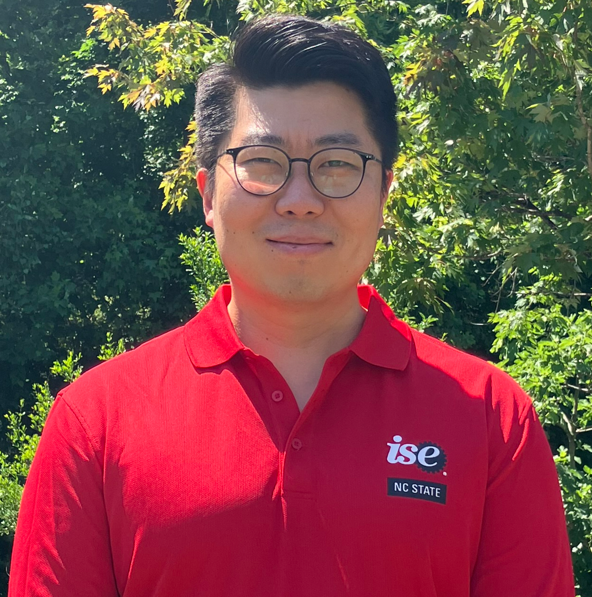

::: {.landing-wrap}
::: {.columns}
::: {.column width="30%"}
::: {.profile-left}

{width=170 fig-cap=false class="profile-img"}

**Donghyun Ko**  
Ph.D. Student  
Industrial & Systems Engineering  
North Carolina State University  

::: {.btn-row}
[<i class="bi bi-file-earmark-pdf"></i> CV](files/Resume.pdf){.btn .btn-outline-primary .btn-sm download=true}
:::

::: {.social}
[<i class="bi bi-linkedin"></i>](https://linkedin.com/in/donghyun-ko-07b268196){target="_blank" aria-label="LinkedIn"}
[<i class="bi bi-github"></i>](https://github.com/kmakdh3692){target="_blank" aria-label="GitHub"}
[ORCID](https://orcid.org/0000-0003-2182-5733){target="_blank" aria-label="ORCID"}
:::

::: {.hr}
:::

::: {#contact .anchor}
### <i class="bi bi-person-lines-fill"></i> Contact
:::

- **Phone**: 919-454-2479
- **Email**: dko3@ncsu.edu
- **Office**: 4331 Fitts-Woolard Hall

:::
:::

::: {.column width="70%"}

::: {#about .anchor}
## About me
:::

Hi, I am a Ph.D. student in Industrial & Systems Engineering at NC State University, working on risk-aware generative AI for industrial predictive analytics. My research focuses on combining diffusion-based Generative models, ML/DL, and optimization to improve additive manufacturing process optimization, RUL/TTF prediction, and decision-making under uncertainty of defense systems.

::: {.hr}
:::

::: {.columns}

::: {.column width="35%"}
### <i class="bi bi-bullseye"></i> Interests
- Generative AI
- Machine / Deep Learning
- Mathematical Optimization
- Industrial system Prognostics
- Anomaly etection & Monitoring
- Additive Manufactuing
:::

::: {.column width="65%"}
### <i class="bi bi-mortarboard"></i> Education
- **Ph.D.**, Industrial & Systems Engineering — NC State (in progress)
- **M.S.**, Industrial Engineering — Texas A&M University
- **B.A.**, Economics — Korea Military Academy
:::

:::

::: {.hr}
:::

### <i class="bi bi-compass"></i> Explore
This site is my personal archive, organized around methodology-focused study notes, paper reviews, research outcomes, and personal investing insights. It brings together how I learn, analyze, experiment, and reflect. Sections below provide more detailed guidance on each area.

::: {.columns}

::: {.column width="50%"}
#### [<i class="bi bi-journal-text"></i> Study Note](study/index.qmd)
::: {.smalltext}
Notes on methodologies I’ve studied across ML/DL, generative AI, optimization, and statistics.
:::

#### [<i class="bi bi-graph-up"></i> Research](research/index.qmd)
::: {.smalltext}
A collection of my published papers and conference talks highlighting my research contributions in the socieity.
:::
:::

::: {.column width="50%"}
#### [<i class="bi bi-file-text"></i> Paper Review](paper_review/index.qmd)
::: {.smalltext}
Summaries and reflections on research papers in my field, focusing on core ideas, methods, and insights.
:::

#### [<i class="bi bi-pie-chart"></i> Others](investing/index.qmd)
::: {.smalltext}
This is an extra archive to stack other funny things!
:::

:::
:::

:::
:::

:::
